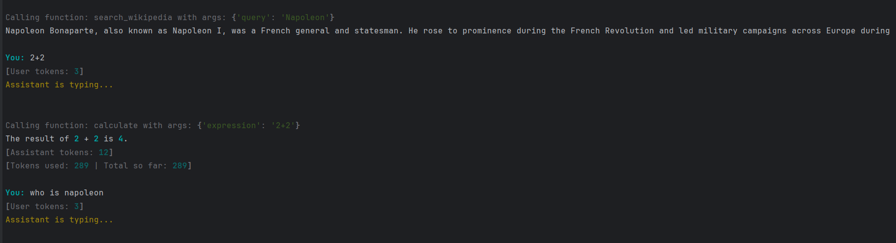
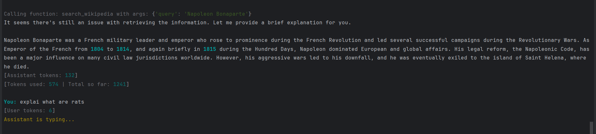
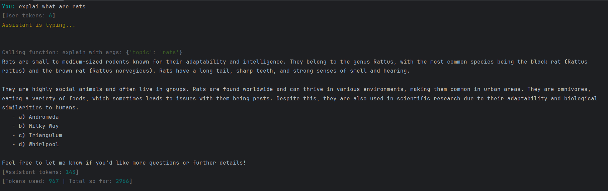
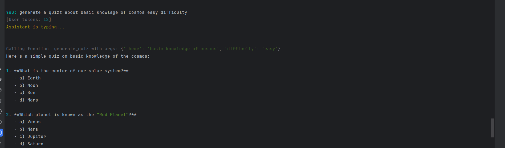

How it works:
The ai has tools that are passed in by the developer so that can answer questions using other apis and tools.  
When the user makes request the ai thinks what took is more appropriate based on promts that are passed.  
Then the functions are asked and the ai makes response and asks the code for them to be executed, the functions needed  
are stated in the response. After that the system calls the functions returns the results in another call to the ai,  
and the ai uses them in the next response to the user.